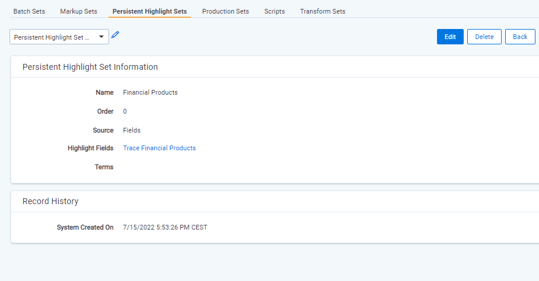

# Dynamic Searching
{: .no_toc }

Dynamic Searching is a feature, which allows user to perform search for different objects than Trace Terms.

1. TOC
{:toc}

---
## Overview 

Dynamic searching is a feature that can be used to search for a pre-defined list of identifiers across communications, providing an enriched review process,  with the use of persistent highlight sets, identifying the list of terms uploaded into this feature.  This works alongside the lexicon alerting process, and allows for customers to have an insight into the communication without reading the whole text.

## Dynamic Searching Configuration

Dynamic Searching can be configured in `Data Transformation` task using `Dynamic Searching Object Types Json` setting on the setup page. In this setting user can set up a list of object types for which searching should be performed. 

  

### Dynamic Search Configuration Parameters

`Dynamic Searching Object Types Json` field is inputted as JSON with each `{}` representing a single object type.

**Parameters of `Dynamic Searching Object Types Json`:**
- `ObjectTypeName` - [Required] an object type for which search will be performed

**Example `Dynamic Searching Object Types Json` configuration:**
```json
[
   {
      "ObjectTypeName":"Financial Products",
   },
   {
      "ObjectTypeName":"Pharmaceutical Product"
   }
]
```

> **`Dynamic Searching Object Types Json` Validation Rules:**
>
> - `ObjectTypeName` must be a name of object type which exists in the workspace
> - One object type can occur only once in `Dynamic Searching Object Types Json` configuration
> - Object type has to have fixed-length field of type identifier
> - Object type can't be saved in configuration if there are no RDOs of given object type
> - Object type can't be saved in configuration if there are RDOs of this object type with duplicated values in identifier field

## Dynamic Searching Execution

After saving `Dynamic Searching Object Types Json` a new configuration is created automatically for every object type.
1) New multiple object field called `Trace` + `ObjectTypeName` is created on `Document` object type. This field joins `Document` and particular `Object Type`.

    

2) New `Persistent Highlight Set` is created and it is set to highlight values from multiple object document field created in previous step.

    

3) New `Data Mapping` is created for multiple object document field created in first step. This data mapping is also added to each `Ingestion Profile` set up for `Document` object type.

    

When new documents are ingested into the system and data transformations are executed on documents' data batch, documents are tagged with objects set up in `Dynamic Searching Object Types Json` setting.


## Dynamic Searching upload files

To upload list of identifiers user can use the auto upload `ZipDrop`in `Data Sources`to auto load a file. 

The user must:

1. Create a new ingestion profile for the `Object Type` and link it to the correct `Data Source`.
2. Save the list of identifiers in a `.ZIP` file and upload into a drop folder in the environment. 
3. The list will be loaded into the matching object and will run Dynamic Searching.

## Dynamic Searching Limitations

1) Objects of object type set up in `Dynamic Searching Object Types Json` cannot contain semicolon (`;`) in identifier field.
2) `Insight.Shared.Toggles.RunTraceDynamicSearchTransformation` toggle must be set to true in order for Dynamic Search to be performed.

## **Dynamic Searching additional information**

1. Dynamic searching uses the `Term Searching Task` configuration to alert on the flag `Perform Term Searching On Trace Cleansed Extracted Text` to determine the type of text the feature will run on. If the flag is turned on, dynamic searching runs across `cleansed text`, but if the flag is turned off it runs across `extracted text`.

2. Dynamic Searching uses the default trace searching Alphabet, please see `Trace Searching` for more information.

   ## 

## **Dynamic Searching use cases**

User can apply this feature for the following use cases:

1. Financial: Searching for financial products such as Public listed company names, Tickers, Stock names, Client names etc. 
2. Pharmaceutical: Drug names, Client lists and competitor names.
3. General: Project names, Confidential lists etc. 
